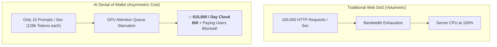
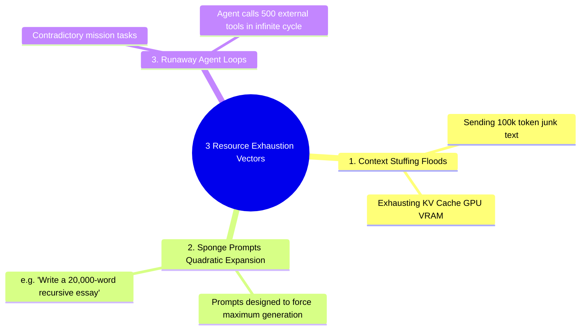
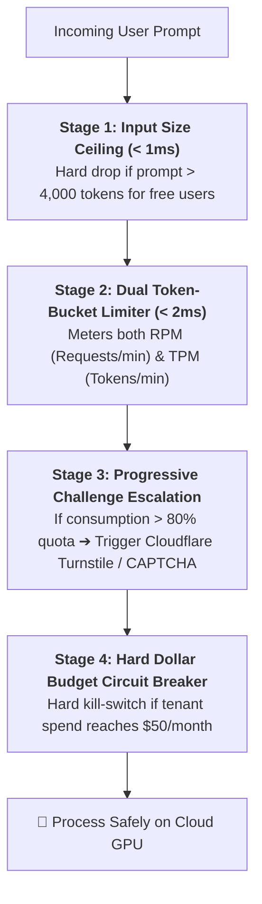
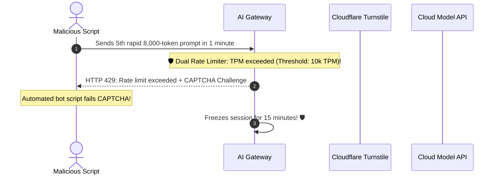

# 09 - AI Abuse & Resource Protection: Denial of Wallet (DoW)

> **Mental Model**:  
> Think of AI Abuse & Denial of Service like a **saboteur at an all-you-can-eat gourmet buffet**:  
> * **The Traditional Web DoS (The Door Stampede)**: Attackers send 100,000 simple HTTP requests per second to overwhelm network bandwidth.  
> * **The AI Denial of Wallet (Asymmetric Resource Exhaustion)**: An attacker sends only **5 requests per second**, but each prompt contains 100,000 tokens of complex text demanding a 4,000-token novel response!  
> * **The Damage**: Each request forces GPUs to run heavy matrix math for 30 seconds, costing **\$2.50 per call**. In 2 hours, the attacker runs up a **\$10,000 cloud bill** and starves the GPU queue for all legitimate paying customers!  
> * **The Defense**: Enforce strict **Input Token Ceilings**, **Dual Token-Bucket Rate Limiting (RPM + TPM)**, and **Progressive CAPTCHA Escalation**!

---

## 📑 Table of Contents
1. [Traditional DoS vs. AI Denial of Wallet (DoW)](#1-traditional-dos-vs-ai-denial-of-wallet-dow)
2. [The 3 Core AI Resource Exhaustion Vectors (OWASP LLM10)](#2-the-3-core-ai-resource-exhaustion-vectors-owasp-llm10)
3. [The 4-Stage AI Abuse Defense Funnel](#3-the-4-stage-ai-abuse-defense-funnel)
4. [Sponge Prompts & Quadratic Expansion Defense](#4-sponge-prompts--quadratic-expansion-defense)
5. [Building an Automated Denial of Wallet Defense Engine in Python](#5-building-an-automated-denial-of-wallet-defense-engine-in-python)
6. [Master Cheat Sheet & Reference Table](#6-master-cheat-sheet--reference-table)

---

## 1. Traditional DoS vs. AI Denial of Wallet (DoW)



---

## 2. The 3 Core AI Resource Exhaustion Vectors (OWASP LLM10)



---

## 3. The 4-Stage AI Abuse Defense Funnel



---

## 4. Sponge Prompts & Quadratic Expansion Defense

> 🚨 **The Clamped `max_tokens` Invariant:**  
> Never allow user clients to omit or specify infinite `max_tokens`!  
> **Always enforce server-side output limits based on user subscription tiers:**  
> * **Free Tier**: Input max $2,000$ tokens / Output max $500$ tokens.  
> * **Pro Tier**: Input max $16,000$ tokens / Output max $2,000$ tokens.



---

## 5. Building an Automated Denial of Wallet Defense Engine in Python

Here is a complete, runnable script implementing Dual Token-Bucket (RPM + TPM) rate limiting, input size clamping, and CAPTCHA escalation:

```python
import time
from typing import Dict, Tuple

class DenialOfWalletDefenseEngine:
    def __init__(self, rpm_limit: int = 5, tpm_limit: int = 10000, max_input_tokens: int = 4000):
        self.rpm_limit = rpm_limit
        self.tpm_limit = tpm_limit
        self.max_input_tokens = max_input_tokens

        # Tenant state tracking: {user_id: {"requests": [timestamps], "tokens": [timestamps]}}
        self.user_history: Dict[str, Dict[str, list]] = {}

    def _estimate_tokens(self, text: str) -> int:
        """Rough token estimate: ~4 chars per token."""
        return max(1, len(text) // 4)

    def evaluate_request(self, user_id: str, prompt_text: str) -> Tuple[bool, str, int]:
        now = time.time()
        token_count = self._estimate_tokens(prompt_text)

        print(f"\n🛡️ [ABUSE GUARD] Evaluating user `{user_id}` | Prompt Tokens: {token_count}")

        # Check 1: Input Size Ceiling
        if token_count > self.max_input_tokens:
            print(f"  🛑 [BLOCKED] Prompt size ({token_count} tok) exceeds {self.max_input_tokens} ceiling!")
            return False, "Error 413: Payload Too Large - Prompt exceeds maximum allowed token length.", 0

        # Initialize user history
        if user_id not in self.user_history:
            self.user_history[user_id] = {"requests": [], "tokens": []}

        history = self.user_history[user_id]

        # Purge entries older than 60 seconds (1 minute window)
        history["requests"] = [t for t in history["requests"] if now - t < 60.0]
        history["tokens"] = [(t, count) for t, count in history["tokens"] if now - t < 60.0]

        # Check 2: Requests Per Minute (RPM)
        if len(history["requests"]) >= self.rpm_limit:
            print(f"  🛑 [RPM EXCEEDED] User reached {len(history['requests'])} / {self.rpm_limit} RPM!")
            return False, "Error 429: Too Many Requests - RPM limit exceeded.", 0

        # Check 3: Tokens Per Minute (TPM)
        current_tpm = sum(count for _, count in history["tokens"])
        if current_tpm + token_count > self.tpm_limit:
            print(f"  🛑 [TPM EXCEEDED] Consumed {current_tpm} + {token_count} tok (Limit: {self.tpm_limit} TPM)!")
            return False, "Error 429: Rate Limit Exceeded - TPM quota exhausted. CAPTCHA verification required.", 0

        # Check 4: Suspicious Burst Challenge
        if current_tpm > (self.tpm_limit * 0.75):
            print("  ⚠️ [HIGH LOAD WARNING] User near 75% TPM capacity ➔ Escalating to Proof-of-Work challenge.")

        # Record valid consumption
        history["requests"].append(now)
        history["tokens"].append((now, token_count))

        # Enforce server-side clamped output tokens
        safe_output_limit = 500 if token_count > 1000 else 1000

        print(f"  ✅ [APPROVED] Request accepted! Assigned server output ceiling: {safe_output_limit} tokens.")
        return True, "APPROVED", safe_output_limit

# --- Test Abuse Defense Engine ---
def test_abuse_protection():
    guard = DenialOfWalletDefenseEngine(rpm_limit=3, tpm_limit=3000, max_input_tokens=2000)

    # 1. Normal Request
    res1, msg1, max_out1 = guard.evaluate_request("usr_alice", "How do I setup authentication?")
    print(f"Outcome: {msg1} | Output Limit: {max_out1}")

    # 2. Giant Payload (Context Stuffing Attack)
    giant_prompt = "A " * 3000 # 3,000 tokens
    res2, msg2, max_out2 = guard.evaluate_request("usr_alice", giant_prompt)
    print(f"Outcome: {msg2}")

    # 3. Rapid Flood (Exhausting RPM)
    for i in range(1, 4):
        guard.evaluate_request("usr_bob", f"Quick question #{i}")

    # 4th rapid request should trigger 429
    res4, msg4, _ = guard.evaluate_request("usr_bob", "Quick question #4 (Should fail!)")
    print(f"Outcome: {msg4}")

# Run Test:
# test_abuse_protection()
```

---

## 6. Master Cheat Sheet & Reference Table

| Abuse Vector | Real-World Impact | Mandatory Architectural Defense |
| :--- | :--- | :--- |
| **Denial of Wallet** | Massive \$10k cloud API billing spikes. | **Dual Token-Bucket Limiters (RPM + TPM)**. |
| **Context Stuffing** | GPU VRAM queue exhaustion. | Strict input token ceilings ($< 4,000$ tokens). |
| **Sponge Prompts** | Forcing maximum length outputs. | Hard server-side `max_tokens` clamping. |
| **Bot Token Floods** | Rapid script-based quota draining. | Progressive Turnstile / CAPTCHA escalation. |

---

## 🎯 Next Step in Phase 11
Now that you have mastered denial of wallet defense and token abuse protection, we will advance to **[10 - AI Security Monitoring](file:///home/user2/PythonProject/Python-for-ai-engineering/11-ai-security/10-ai-security-monitoring)** to master real-time red-team telemetry, automated incident detection, and SIEM security integration!
